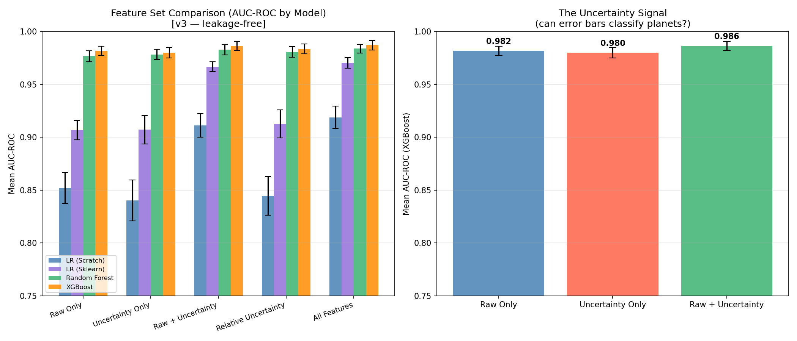
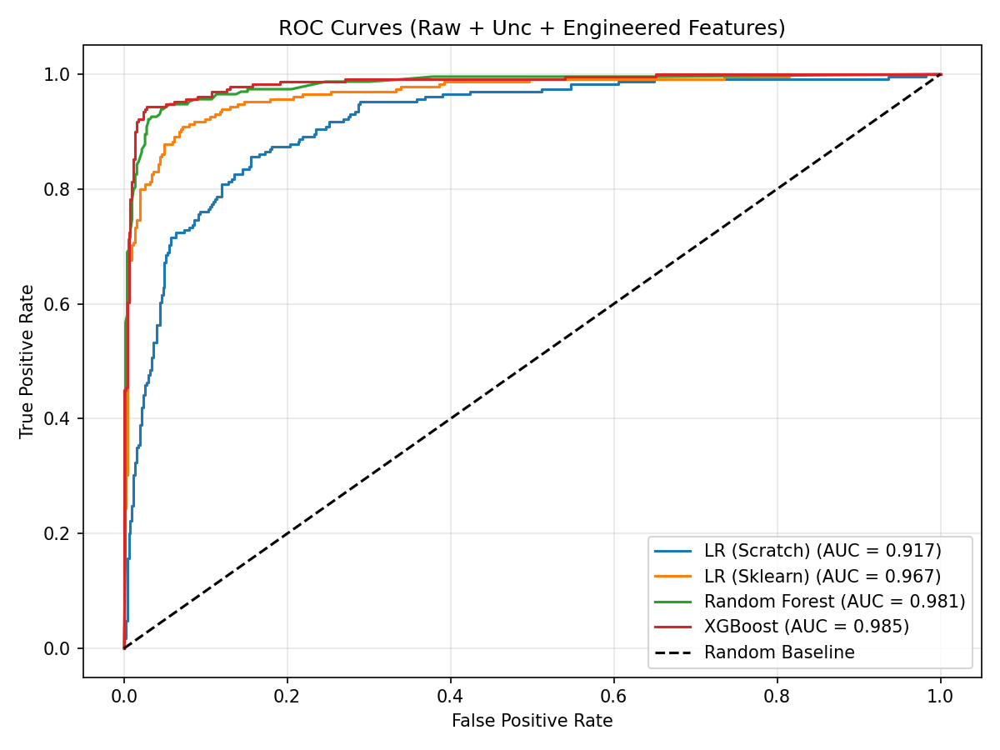
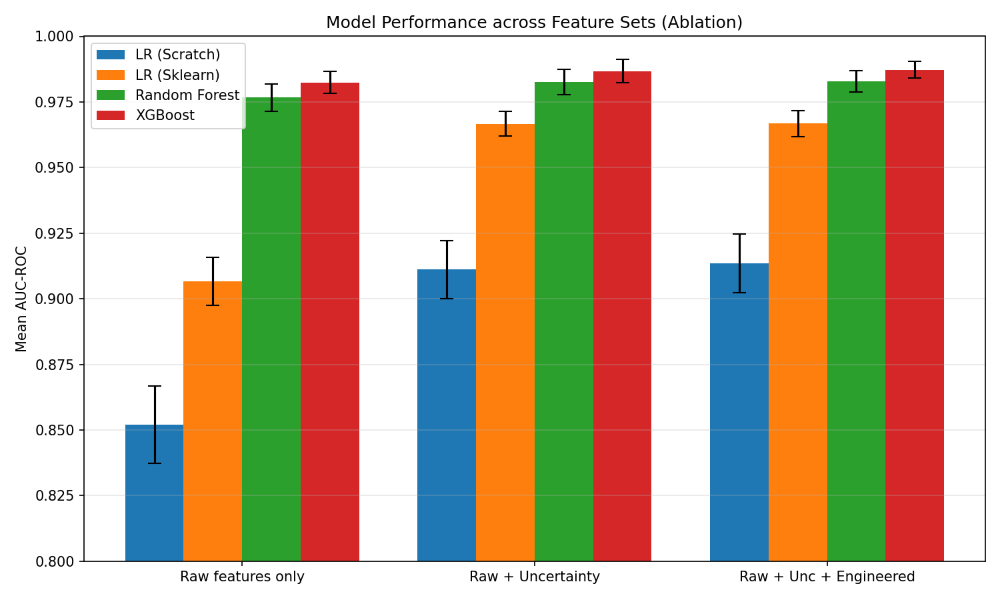
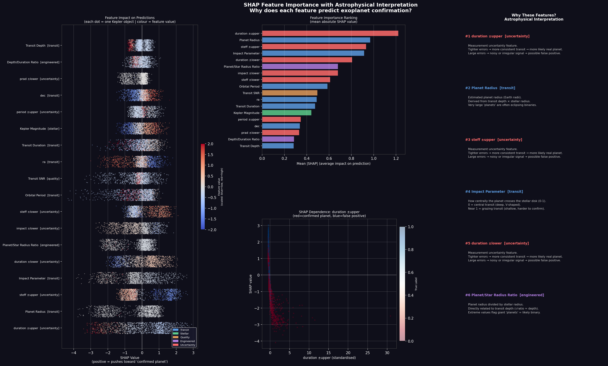
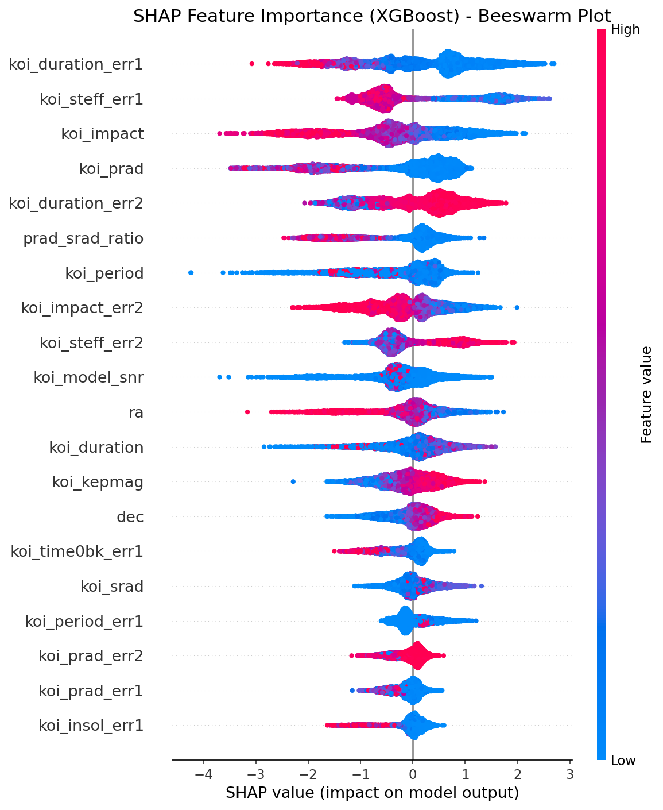
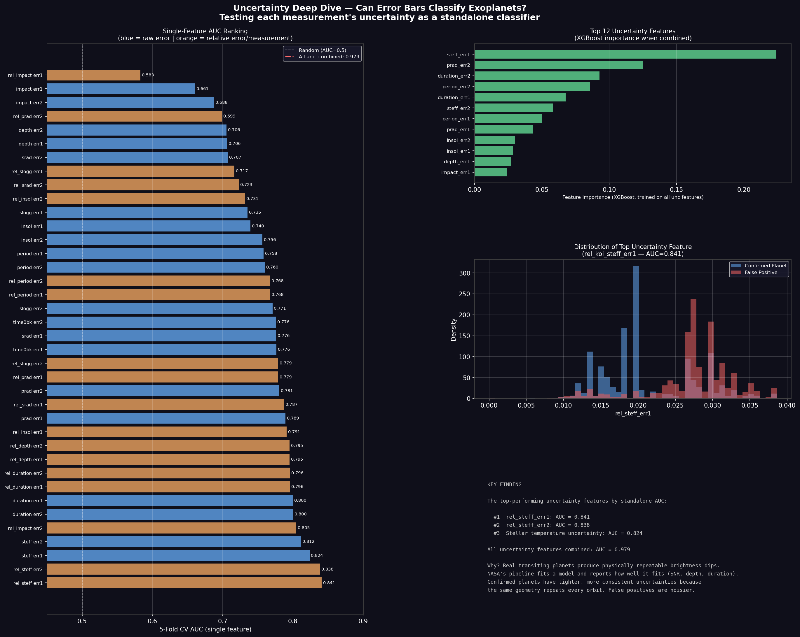
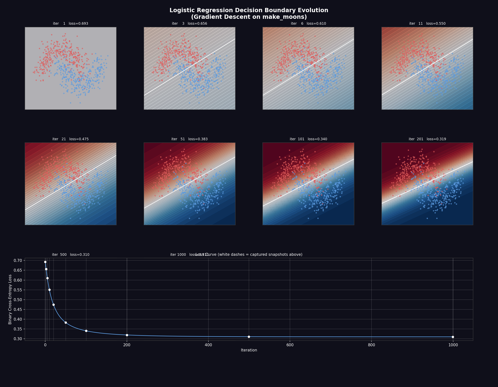
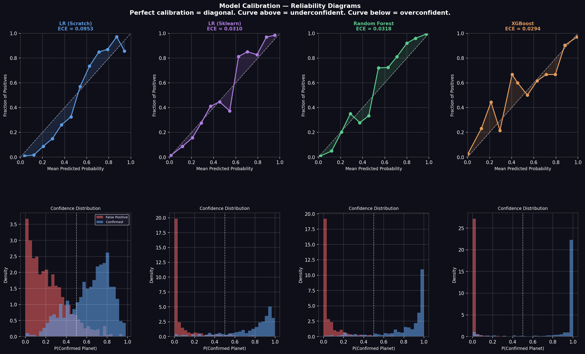
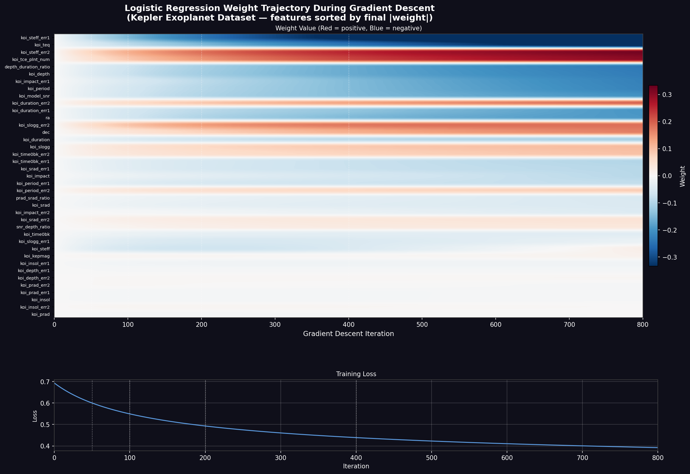

# Kepler Exoplanet Classification

> Can measurement uncertainty alone classify exoplanets? We tested it.

Machine learning project classifying Kepler Objects of Interest (KOIs) as confirmed exoplanets or false positives using the [NASA Exoplanet Archive](https://exoplanetarchive.ipac.caltech.edu/). We compare four models across five feature sets — including an ablation experiment showing that **error bars alone achieve within 0.002 AUC of raw measurements**.

  

---

## Key Findings

- **XGBoost (All Features) achieves 95.1% accuracy and AUC 0.9864** under 10-fold stratified cross-validation
- **Uncertainty-only features match raw measurements almost exactly** — XGBoost AUC drops just 0.0019 when error bars replace actual measurements, suggesting measurement precision encodes astrophysical signal independently
- **Tree models are robust to feature set choice** — Random Forest and XGBoost AUC stays above 0.976 across all five feature sets; linear models degrade significantly without engineered features
- SHAP analysis identifies transit depth, duration, and planetary radius ratio as the most influential features

---

## Results

### AUC-ROC by Model and Feature Set (10-fold stratified CV)

| Feature Set | LR Scratch | LR Sklearn | Random Forest | XGBoost |
|---|---|---|---|---|
| Raw Only | 0.8521 | 0.9067 | 0.9766 | 0.9818 |
| Uncertainty Only | 0.8401 | 0.9071 | 0.9783 | **0.9799** |
| Raw + Uncertainty | 0.9111 | 0.9666 | 0.9827 | 0.9864 |
| Relative Uncertainty | 0.8444 | 0.9127 | 0.9807 | 0.9836 |
| All Features | 0.9189 | 0.9703 | 0.9839 | **0.9870** |

### Uncertainty Ablation (XGBoost AUC)

| Feature Set | XGBoost AUC | Δ vs Raw Only |
|---|---|---|
| Raw Only | 0.9818 | — |
| Uncertainty Only | 0.9799 | −0.0019 |
| Raw + Uncertainty | 0.9864 | +0.0046 |

Gap is under 0.002 — well within noise. Error bars carry nearly as much classification signal as the measurements themselves.

---

## Visualizations

<p align="center">
  
  <br><em>XGBoost AUC across feature sets — uncertainty-only nearly matches raw measurements</em>
</p>

<p align="center">
  
</p>

<p align="center">
  
</p>

<p align="center">
  
  <br><em>SHAP values for astrophysical features — transit depth and planetary radius dominate classification</em>
</p>

<p align="center">
  
  <br><em>Full SHAP beeswarm — feature impact distribution across all samples</em>
</p>

<p align="center">
  
  <br><em>Deep dive into uncertainty signal — how error bar magnitude separates confirmed planets from false positives</em>
</p>

<p align="center">
  
  <br><em>Decision boundary evolution during logistic regression training</em>
</p>

<p align="center">
  
  <br><em>Probability calibration — how well each model's confidence matches actual outcomes</em>
</p>

<p align="center">
  
  <br><em>Logistic regression weight trajectory across gradient descent iterations</em>
</p>

---

## Models

| Model | Implementation |
|---|---|
| Logistic Regression (Scratch) | Custom gradient descent, lr=0.01, 1000 iterations |
| Logistic Regression (Sklearn) | `LogisticRegression(max_iter=1000)` |
| Random Forest | `n_estimators=100` |
| XGBoost | `n_estimators=100`, `eval_metric='logloss'` |

---

## Feature Sets

| Name | Contents |
|---|---|
| Raw Only | Base measurement columns |
| Uncertainty Only | `err1`/`err2` columns only |
| Raw + Uncertainty | Base + error columns |
| Relative Uncertainty | Error/measurement ratios (e.g. `koi_period_err1 / koi_period`) |
| All Features | Base + uncertainty + 3 engineered ratios (`depth_duration_ratio`, `prad_srad_ratio`, `snr_depth_ratio`) |

All preprocessing (imputation, scaling) is fit on training folds only — no leakage.

---

## How to Run

```bash
pip install -r requirements.txt
python src/run_experiments.py
```

`src/cleaner.py` processes `data/cumulative.csv` (raw NASA KOI table) into `data/kepler_clean_v2.csv`. `src/run_experiments.py` runs all 20 experiments (5 feature sets × 4 models) and writes results to `results/experiment_results_v3.csv`.

---

## Project Structure

```
├── data/                   # raw and cleaned datasets
├── src/                    # experiment runner, cleaner, models
├── results/                # CSV results + figures
│   └── figures/
└── visualizations/         # additional plots and generation scripts
```

---

## Team

- [Ayaan Farooq](https://github.com/Ayaan0620)
- Bo Van Laetham
- Timothy Moskal

---

## Dataset

NASA Exoplanet Archive — [Cumulative KOI Table](https://exoplanetarchive.ipac.caltech.edu/cgi-bin/TblView/nph-tblView?app=ExoTbls&config=cumulative)
